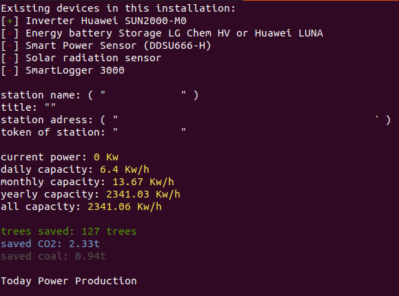

# Huawei sun2000 API CLI
[](https://github.com/BlazejosP/huawei-sun2000-API-CLI/blob/master/LICENSE)
 [](https://github.com/BlazejosP/huawei-sun2000-API-CLI/issues)
 


If you found this software usefully and do like to say thank you!
-
You can donate for charity and support small <B>Maria</B> in her fight against SMA 1 her parents try collect $2.1 million for gene therapy
there is a link and full desciption
<a href="https://www.siepomaga.pl/en/maria#wplaty"></a>
they collecting until 20 May 2021

Linux Command line tool for acess Huawei FusionSolarApp API
-
Huawei sun2000-(3KTL-10KTL)-M0 all models comand line bash API for download data from their FusionSolarApp web service. To use this tool you need an acount in their service and then request developer account. That all means that you need Huawei sun2000 https://solar.huawei.com/eu/products series PV inverter configured already with their cloud service or someone who give you acess to cloud service related with his Huawei device.

To use this script you need account on Huawei FusionSolar https://eu5.fusionsolar.huawei.com and developer privilege.

Contact service team at eu_inverter_support@huawei.com to create an openAPI account for your plant. in email like this:

Email Template
-
```
Hi, I hereby request an openAPI user account to access the data from my inverter(s) through the new #FusionSolar API:

System name: <--here data--> 

Username: <--here data--> 

Plant Name: <--here data--> 

SN Inverter: <--here data-->
```

Device Sun2000-(from 3KTL to 10KTL meaby also others)-M0
-
Device itself must be equipped with Smart Dongle existing two types: 

Smart Dongle-4G (sends data through cellular network -> to internet -> and then stright to cloud service)

SmartDongle-WLAN-FE (sends data with use of user lan or wlan -> through user getway -> internet -> to cloud service)

Whatever dongle is in use there must be an connection to internet if not cloud service simple don't recieve new data. 


Installation
-
This is tool for login and get data from Huawei FusionSolar https://eu5.fusionsolar.huawei.com
This tool use official FusionSolar API described here https://forum.huawei.com/enterprise/en/communicate-with-fusionsolar-through-an-openapi-account/thread/591478-100027 by manufacturer. Data from official API are instantous or every 5 mintes, hour, day, monthly, yearly. We also use unofficial API called "Kiosk Mode" to grab especially power production and basic data. 

You must have installed on your linux tools like curl, jq, httpie, grep, mosquitto_pub on debian and similar systems. They are necessary for working of this bash scripts. On Debian like system you can download them with:
```
sudo apt-get install curl

sudo apt-get install jq

sudo apt-get install grep

sudo apt-get install httpie

sudo apt-get install mosquitto-clients (if you use MQTT sending option)
```
On other linux distributions check used package system but that are standard linux command line tools so should be avaiable without problems if are not installed already. 

Configuration&Usage
-
There are two files


<b>fusionsolarapp.sh</b> - which is using official Huawei API. Now this script can pull and show on the screen data Real-time(actually), every 5min , daily, monthly, yearly for Plants (which may include many inverters+any other devices data together) and Individual Devices (like every one inverter, battery etc.) This script is now under development and for now can only grab all the data from your devices and show them on screen. In not so long time will be able also send this data to InfluxDB(grafana), Domoticz, MQTT. As for now if you need export you can use kioskmode which has this functionality implemented or download older version https://github.com/BlazejosP/huawei-sun2000-API-CLI/releases/tag/1.2 were export to influxDB is working.


<b>kioskmode.sh</b> - use unoficial API related to "Kiosk Mode" here data are refreshed every 5 minutes on server so in cron configure this script to pull data every 5 minutes during sunlight. Crontab example:
```
*/5 5-22 * * *          /home/WhateverFolder/huawei-sun2000-API-CLI/kioskmode.sh
```
You must login to FusionSolarApp webpage with your username and password. Open webpage and go to "Kiosk View" top right buttons near "Home Page" "Message" and "About" Inside "Kiosk View Settings" activate option "Whether to enable" and copy URL which is necessary to be pasted inside this script. Login and Password is not necessary to be used to get this data only individual URL for each power plant so this URL should be confidential. After swithing "Whether to enable" On and Off and again On new URL is autogenerated so paste to scipt this new data after changing.
```
kiosk_mode_url="<--this link from webpage-->"
```
Check if in Configuration section
```
show_data_in_terminal=true
```
to see important data on screen from your inverter. But then after initial tests if you use kioskmode.sh only by cron in automatic way to pull data you can simply swith this mode to <B>false</B> you do not need data on screen if main task of this script will be pull data from webservice and insert to influxdb or Domoticz.  



After that you can configure inserting data to InfluxDB
```
send_data_to_influxDB=true
```
but you need working server with this database. The same is with sending data stright to Domoticz or with use of MQTT.
There is necesary to have working Domoticz home automation system and in secound case also MQTT server. For all of them are configuration sections like this for influxDB. BTW in case of sending data to Domoticz I myself prefer using MQTT more flexible in my opinion but you can chose whatever you prefer just remember to made options which you do not need as false. 
```
if [[ $send_data_to_influxDB == true ]];
	then
	influxdb_server="<--here data-->" #for example "localhost" or "192.168.1.4"
	influxdb_port="<--here data-->" # influxdb input port for example "8086"
	influxdb_database="<--here data--> #database name for example "solar_panels_data" 
	influxdb_db_insert_user="<--here data-->" # user with privilge to insert for example "my_root_user" 
	influxdb_db_insert_password="<--here data-->" #for example "secret_password" 
fi
```


