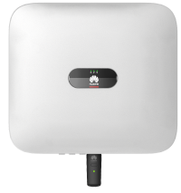
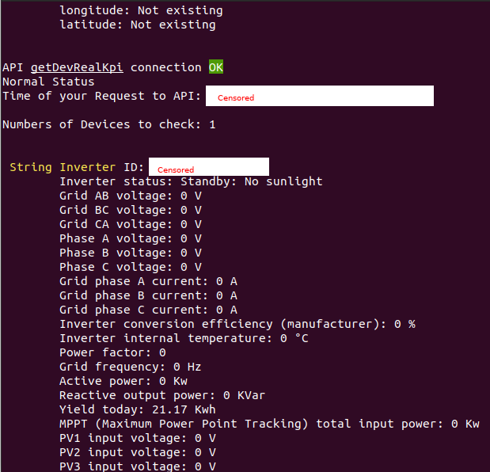
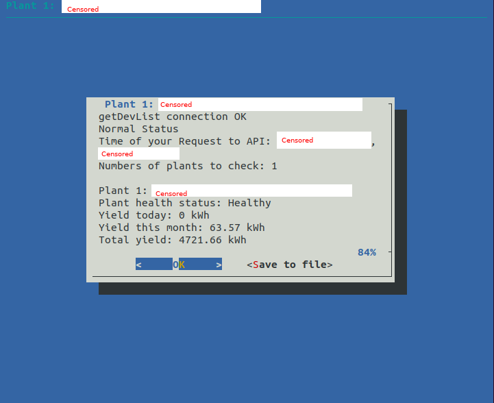

# Huawei sun2000 API CLI 


[](https://github.com/BlazejosP/huawei-sun2000-API-CLI/blob/master/LICENSE)
 [](https://github.com/BlazejosP/huawei-sun2000-API-CLI/issues)
 


If you found this software usefully and do like to say thank you!
-
You can donate for charity and support small <B>Maria</B> in her fight against SMA 1 her parents try collect $2.1 million for gene therapy
there is a link and full desciption
<a href="https://www.siepomaga.pl/en/maria#wplaty"></a>
they collecting now until 22 November 2021 they have now half of the sum around $1 milion

Linux Command line tool for acess Huawei FusionSolarApp API
-
Huawei sun2000-(3KTL-10KTL)-M0 all models comand line bash API for download data from their FusionSolarApp web service. To use this tool you need an acount in their service and then request developer account. That all means that you need Huawei sun2000 https://solar.huawei.com/eu/products series PV inverter configured already with their cloud service or someone who give you acess to cloud service related with his Huawei device.

To use this script you need account on Huawei FusionSolar https://eu5.fusionsolar.huawei.com and developer privilege.

Contact service team at eu_inverter_support@huawei.com to create an openAPI account for your plant. in email like this:

Email Template
-
```
Hi, I hereby request an openAPI user account to access the data from my inverter(s) through the new #FusionSolar API:

System name: <--here data--> 

Username: <--here data--> 

Plant Name: <--here data--> 

SN Inverter: <--here data-->
```

Device Sun2000-(from 3KTL to 10KTL meaby also others)-M0
-
Device itself must be equipped with Smart Dongle existing two types: 

Smart Dongle-4G (sends data through cellular network -> to internet -> and then stright to cloud service)

SmartDongle-WLAN-FE (sends data with use of user lan or wlan -> through user getway -> internet -> to cloud service)

Whatever dongle is in use there must be an connection to internet if not cloud service simple don't recieve new data. 



Installation
-
This is tool for login and get data from Huawei FusionSolar https://eu5.fusionsolar.huawei.com
This tool use official FusionSolar API described here https://forum.huawei.com/enterprise/en/communicate-with-fusionsolar-through-an-openapi-account/thread/591478-100027 by manufacturer. Data from official API are instantous or every 5 mintes, hour, day, monthly, yearly.

You must have installed on your linux tools like curl, jq, httpie, grep, mosquitto_pub on debian and similar systems. They are necessary for working of this bash scripts. On Debian like system you can download them with:
```
sudo apt-get install curl

sudo apt-get install jq

sudo apt-get install grep

sudo apt-get install httpie

sudo apt-get install mosquitto-clients (if MQTT sending option will be used)

sudo apt-get install dialog (if TUI will be used)

```
On other linux distributions check used package system but that are standard linux command line tools so should be avaiable without problems if are not installed already. 

Configuration&Usage
-
<b>fusionsolarapp.sh</b> - which is using official Huawei API called OpenAPI by Huawei. Now this script can pull and show on the screen data Real-time(actually), every 5min , daily, monthly, yearly for Plants (which may include many inverters+any other devices data together) and Individual Devices (like every one inverter, battery etc.) This script is now under development and for now can only grab all the data from your devices and show them on screen. In not so long time will be able also send this data to InfluxDB(grafana), Domoticz, MQTT. This script need individual configuration inside if you need data tailored to your needs. How do this is described here https://github.com/BlazejosP/huawei-sun2000-API-CLI/issues/12



<b>fusionsolarapp_interface.sh</b>  - this is the same program but with TUI graphical interface you must install additionally dialog. As for now you can login inside software will ask you about Login and Password if this data are not provided by config.conf. Then inside you can check realtime plant performace and devices which are inside plant together with their performance. Also is possible save data's to a file. This program is now partialy working so not every functionality is already implemented about you will be advised if you chose not working yet part. When will be finished will have the same usability as text version.




